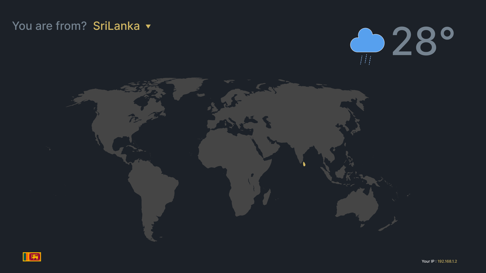
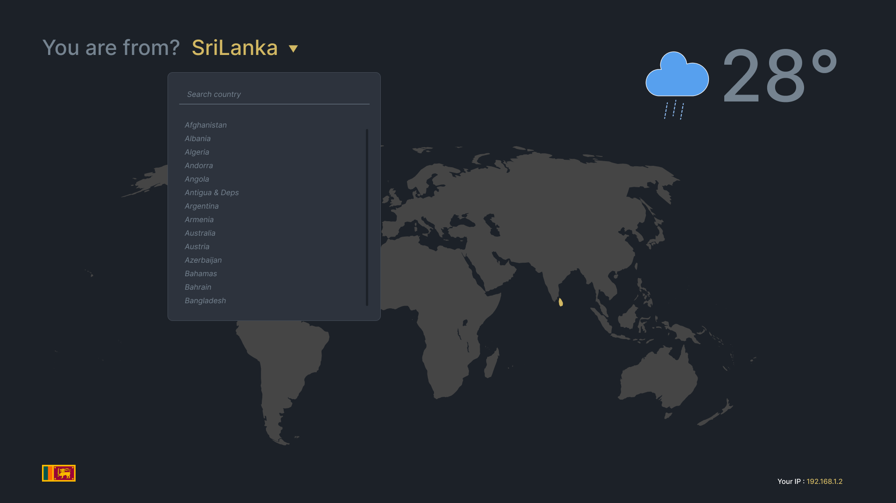

# Hacktober Fest 2023 Weather App

Welcome to the Hacktober Fest 2023 Weather App project! This open-source project aims to create a weather application with a world map, allowing users to select a country from a dropdown menu and providing automatic IP detection to display the user's country and weather information. We invite you to contribute to this project as part of Hacktober Fest 2023, which begins on October 26th!

## Project Overview

This project's main goal is to create a user-friendly weather app with the following features:

- **World Map**: An interactive world map will be displayed, allowing users to explore weather information for different countries visually.

- **Country Selection**: Users can select a country from a dropdown menu to get detailed weather information for the chosen location.

- **Automatic IP Detection**: The app will automatically detect the user's IP address and display weather information for their current location.

## Design


## Getting Started

Follow these steps to get started with contributing to the project:

1. **Fork the Repository**: Click the "Fork" button at the top right corner of this repository to create your own copy of the project.

2. **Clone the Repository**: Clone your forked repository to your local machine using the following command:

   ```
   git clone https://github.com/VihangaN/hacktoberfest-2023
   ```

3. **Install Dependencies**: Make sure you have the necessary dependencies installed. You might need Node.js and npm. Check the project's `package.json` for more information.

4. **Create a Branch**: Create a new branch for your contributions using a descriptive name. For example:

   ```
   git checkout -b feature/add-weather-info
   ```

5. **Make Changes**: Implement the features or improvements you'd like to contribute to the project.

6. **Commit Changes**: Commit your changes with a meaningful commit message:

   ```
   git commit -m "Add weather data for selected countries"
   ```

7. **Push Changes**: Push your changes to your forked repository:

   ```
   git push origin feature/add-weather-info
   ```

8. **Create a Pull Request**: Go to the [original repository](https://github.com/VihangaN/hacktoberfest-2023) and click the "New Pull Request" button. Provide a descriptive title and description for your pull request, then submit it.

## Contribution Guidelines

Please follow these guidelines when contributing to the project:

- Create a new branch for each set of changes you make and name it descriptively.

- Make sure your code follows best practices, is well-documented, and is free of errors.

- Test your changes thoroughly to ensure they work as expected.

- Be respectful and open to feedback from maintainers and other contributors.

- Remember that this project follows the Hacktober Fest code of conduct. Please be respectful and inclusive in your interactions.


## Contact

If you have any questions or need further assistance, feel free to contact us:

We look forward to your contributions to the Hacktober Fest 2023 Weather App! Happy coding!